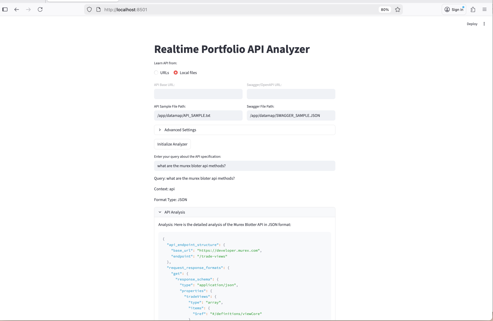

# Llama Local RAG API Specification Analyzer

This application provides a RAG-based API specification and analysis system for Swagger/OpenAPI files using a local Llama server and FAISS.



## Prerequisites

- Docker installed on your system
- Make installed on your system
- A local Llama server running on your Mac (for example, Ollama or llama.cpp server)
- Swagger/OpenAPI specification URL

## Quick Start

### Using Make

The project includes a Makefile for common operations:

1. Show available commands:
```bash
make help
```

2. Build the Docker image:
```bash
make build
```

3. Run the containers (requires a local Llama server), either or both:
```bash
export LLAMA_BASE_URL=http://host.docker.internal:11434
export LLAMA_INFERENCE_MODEL=llama3.2
export LLAMA_EMBEDDING_MODEL=nomic-embed-text
make run_all
OR 
make run_api ; make run_streamlit
```

4. Clean up Docker resources:
```bash
make clean
```

### Manual Docker Commands

If you prefer not to use Make:

1. Build the Docker image:
```bash
docker build -t llama-local-rag-api .
```

2. Run the streamlit APP container:
```bash
make run_streamlit
```

## Development

### Using Make

1. Set up development environment:
```bash
make dev
```

2. Run tests:
```bash
make test
```

3. Run linting:
```bash
make lint
```

### Manual Development Setup

For local development without Docker:

1. Create a virtual environment:
```bash
python -m venv venv
source venv/bin/activate  # On Windows: venv\Scripts\activate
```

2. Install dependencies:
```bash
pip install -r requirements.txt
pip install -r requirements-dev.txt
```

3. Run the application:
```bash
streamlit run datamap/realtime_portfolio_schema_analyzer.py
```

## Environment Variables

The following environment variables can be set when running the container:

- `LLAMA_BASE_URL`: OpenAI-compatible Llama server base URL (default: http://host.docker.internal:11434)
- `LLAMA_API_KEY`: API key for the server if required (default: local)
- `LLAMA_INFERENCE_MODEL`: Llama model to use (default: llama3.2)
- `LLAMA_EMBEDDING_MODEL`: Embedding model to use (default: nomic-embed-text)
- `LLAMA_EMBEDDINGS_PROVIDER`: Embeddings provider (`openai`, `ollama`, or `hf`, default: ollama)
- `HF_EMBEDDING_MODEL`: HuggingFace model when provider is `hf` (default: all-MiniLM-L6-v2)
- `HF_EMBEDDING_CACHE_DIR`: Cache directory for HF models (default: /embedding_model)
- `LLAMA_EMBEDDING_CHUNK_SIZE`: Text chunk size for embeddings (default: 2000)
- `LLAMA_EMBEDDING_CHUNK_OVERLAP`: Chunk overlap for embeddings (default: 200)

1. Quick Run Local Llama Server
```bash
export LLAMA_BASE_URL="http://host.docker.internal:11434" ; make build ; make run_all
```

## Project Structure

- `llama_local_datamap_rag.py`: Core RAG implementation
- `realtime_portfolio_schema_analyzer.py`: Streamlit interface
- `realtime_portfolio_api.py`: FastAPI interface
- `api_swagger_data_source.py`: API/Swagger data source handler
- `requirements.txt`: Production Python dependencies
- `requirements-dev.txt`: Development Python dependencies
- `requirements-api.txt`: API-specific dependencies
- `Dockerfile`: Container configuration
- `Makefile`: Build and development commands
- `config/`: Directory for configuration files

## Testing and Quality Assurance

The project includes:
- Unit tests (run with `make test`)
- Linting (run with `make lint`)
- Type checking with mypy
- Code formatting with black and isort

## Make sure Ollama Server runs localy with modes ollama3.2 and nomic-embed-tex
```bash
admin@MacBookPro api_realtime-portfolio_llama_local_rag % ollama ps          
NAME                       ID              SIZE      PROCESSOR    CONTEXT    UNTIL              
nomic-embed-text:latest    0a109f422b47    565 MB    100% CPU     8192       3 minutes from now    
admin@MacBookPro api_realtime-portfolio_llama_local_rag % ollama list
NAME                       ID              SIZE      MODIFIED       
nomic-embed-text:latest    0a109f422b47    274 MB    23 minutes ago    
llama2:latest              78e26419b446    3.8 GB    14 months ago     
llama3.2:latest            a80c4f17acd5    2.0 GB    15 months ago     
admin@MacBookPro api_realtime-portfolio_llama_local_rag %
```

## License

This project is licensed under the MIT License - see the LICENSE file for details.

