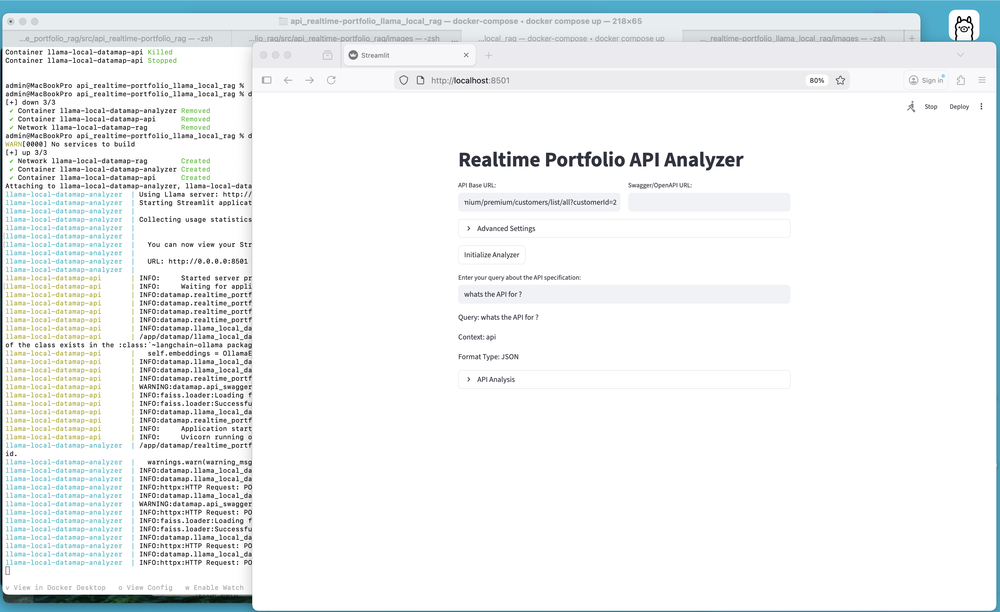

# Llama Local RAG API Specification Analyzer

This application provides a RAG-based API specification and analysis system for Swagger/OpenAPI files using a local Llama server and FAISS.




## Prerequisites

- Docker installed on your system
- Make installed on your system
- A local Llama server running on your Mac (for example, Ollama or llama.cpp server)
- Swagger/OpenAPI specification URL

## Quick Start

### Using Make

The project includes a Makefile for common operations:

1. Show available commands:
```bash
make help
```

2. Build the Docker image:
```bash
make build
```

3. Run the containers (requires a local Llama server), either or both:
```bash
export LLAMA_BASE_URL=http://host.docker.internal:11434
export LLAMA_INFERENCE_MODEL=llama3.2
export LLAMA_EMBEDDING_MODEL=nomic-embed-text
make run_all
OR 
make run_api ; make run_streamlit
```

4. Clean up Docker resources:
```bash
make clean
```

### Manual Docker Commands

If you prefer not to use Make:

1. Build the Docker image:
```bash
docker build -t llama-local-rag-api .
```

2. Run the streamlit APP container:
```bash
make run_streamlit
```

## Development

### Using Make

1. Set up development environment:
```bash
make dev
```

2. Run tests:
```bash
make test
```

3. Run linting:
```bash
make lint
```

### Manual Development Setup

For local development without Docker:

1. Create a virtual environment:
```bash
python -m venv venv
source venv/bin/activate  # On Windows: venv\Scripts\activate
```

2. Install dependencies:
```bash
pip install -r requirements.txt
pip install -r requirements-dev.txt
```

3. Run the application:
```bash
streamlit run datamap/realtime_portfolio_schema_analyzer.py
```

## Environment Variables

The following environment variables can be set when running the container:

- `LLAMA_BASE_URL`: OpenAI-compatible Llama server base URL (default: http://host.docker.internal:11434)
- `LLAMA_API_KEY`: API key for the server if required (default: local)
- `LLAMA_INFERENCE_MODEL`: Llama model to use (default: llama3.2)
- `LLAMA_EMBEDDING_MODEL`: Embedding model to use (default: nomic-embed-text)
- `LLAMA_EMBEDDINGS_PROVIDER`: Embeddings provider (`openai`, `ollama`, or `hf`, default: ollama)
- `HF_EMBEDDING_MODEL`: HuggingFace model when provider is `hf` (default: all-MiniLM-L6-v2)
- `HF_EMBEDDING_CACHE_DIR`: Cache directory for HF models (default: /embedding_model)
- `LLAMA_EMBEDDING_CHUNK_SIZE`: Text chunk size for embeddings (default: 2000)
- `LLAMA_EMBEDDING_CHUNK_OVERLAP`: Chunk overlap for embeddings (default: 200)

1. Quick Run Local Llama Server
```bash
export LLAMA_BASE_URL="http://host.docker.internal:11434" ; make build ; make run_all
```

## Project Structure

- `llama_local_datamap_rag.py`: Core RAG implementation
- `realtime_portfolio_schema_analyzer.py`: Streamlit interface
- `realtime_portfolio_api.py`: FastAPI interface
- `api_swagger_data_source.py`: API/Swagger data source handler
- `requirements.txt`: Production Python dependencies
- `requirements-dev.txt`: Development Python dependencies
- `requirements-api.txt`: API-specific dependencies
- `Dockerfile`: Container configuration
- `Makefile`: Build and development commands
- `config/`: Directory for configuration files

## Testing and Quality Assurance

The project includes:
- Unit tests (run with `make test`)
- Linting (run with `make lint`)
- Type checking with mypy
- Code formatting with black and isort

## Make sure Ollama Server runs localy with modes ollama3.2 and nomic-embed-tex
```bash
admin@MacBookPro api_realtime-portfolio_llama_local_rag % ollama ps          
NAME                       ID              SIZE      PROCESSOR    CONTEXT    UNTIL              
nomic-embed-text:latest    0a109f422b47    565 MB    100% CPU     8192       3 minutes from now    
admin@MacBookPro api_realtime-portfolio_llama_local_rag % ollama list
NAME                       ID              SIZE      MODIFIED       
nomic-embed-text:latest    0a109f422b47    274 MB    23 minutes ago    
llama2:latest              78e26419b446    3.8 GB    14 months ago     
llama3.2:latest            a80c4f17acd5    2.0 GB    15 months ago     
admin@MacBookPro api_realtime-portfolio_llama_local_rag %
```

## Prism Mock Auth Token

The Prism mock server exposes a static token endpoint for local testing.

1. Get a mock token:
```bash
curl -X POST http://localhost:4010/auth/token
```

2. Use the token on API calls:
```bash
curl -H "Authorization: Bearer prism-static-token" \
  http://localhost:4010/v1/api/trade-blotter/trade-views
```

Example session:
```bash
 
  curl -X POST http://localhost:4010/auth/token
{"access_token":"prism-static-token","token_type":"Bearer","expires_in":3600}%
 
 
  curl -H "Authorization: Bearer prism-static-token" \
  http://localhost:4010/trade-views
{"tradeViews":[{"id":"44a30c97-a4c1-407e-8293-ecafd163e299","label":"Daily Basic","description":"User friendly description for Daily Basic"},{"id":"6d2a8328-0d53-40dd-bfc2-77802672eca8","label":"Daily Detailed","description":"User friendly description for Daily Detailed"},{"id":"95c14eb5-034f-4b81-90c0-9c44b12d74b1","label":"Live Basic"},{"id":"7843c17a-e1d7-4135-831a-90b421b3d469","label":"Live Detailed"}]}%
  curl -H "Authorization: Bearer prism-static-token" \
  http://localhost:4010/trade-views/44a30c97-a4c1-407e-8293-ecafd163e299/snapshots/1
{"id":"44a30c97-a4c1-407e-8293-ecafd163e299","label":"Daily Basic","description":"User friendly description for Daily Basic View","staleDataTimestamp":"2022-10-20T15:32:12.124Z","schema":{"fields":[{"name":"BrokerFeeCcy","title":"BrokerFeeCcy","type":"string"},{"name":"ContractTypology","type":"string"},{"name":"Counterpart","type":"string"},{"name":"FaceAmount","type":"number"},{"name":"FaceCcy","type":"string"},{"name":"GlobalID","type":"string"},{"name":"Instrument","type":"string"},{"name":"InternalStatus","type":"number"},{"name":"LiveStatus","type":"string"},{"name":"MarginAmount","type":"number"},{"name":"Maturity","type":"number"},{"name":"NetPriceOrRate","type":"number"},{"name":"NominalCcy","type":"string"},{"name":"OtherCcy","type":"string"},{"name":"OtherNominal","type":"number"},{"name":"Portfolio","type":"string"},{"name":"Price","type":"number"},{"name":"SalesUser","type":"number"},{"name":"Typology","type":"number"},{"name":"User","type":"string"},{"name":"ValidationLevel","type":"string"}],"primaryKey":["GlobalID","Instrument","ContractTypology","Counterpart","FaceCcy"]},"data":[{"BrokerFeeCcy":"","ContractTypology":"Spot","Counterpart":"COMPANY B","FaceAmount":-300000,"FaceCcy":"EUR","GlobalID":"","Instrument":"EUR/USD","InternalStatus":"Ins","LiveStatus":"MKT_OP","MarginAmount":360,"Maturity":"09/10/2020","NetPriceOrRate":1.1759,"NominalCcy":"","OtherCcy":"USD","OtherNominal":352770,"Portfolio":"FX AVERAGING","Price":1.1747,"SalesUser":"","Typology":"Spot","User":"MUREXFO","ValidationLevel":"EventPending"},{"BrokerFeeCcy":"","ContractTypology":"Spot","Counterpart":"COMPANY B","FaceAmount":-300000,"FaceCcy":"EUR","GlobalID":"","Instrument":"EUR/USD","InternalStatus":"Cncl","LiveStatus":"DEAD","MarginAmount":360,"Maturity":"09/10/2020","NetPriceOrRate":1.1759,"NominalCcy":"","OtherCcy":"USD","OtherNominal":352770,"Portfolio":"FX AVERAGING","Price":1.1747,"SalesUser":"","Typology":"Spot","User":"MUREXFO","ValidationLevel":"MxDefault"},{"BrokerFeeCcy":"","ContractTypology":"Future COM","Counterpart":"BMFBOVESPA SA","FaceAmount":100,"FaceCcy":"","GlobalID":"","Instrument":"DE_BS_PHY_EEX","InternalStatus":"Ins","LiveStatus":"LIVE","MarginAmount":0,"Maturity":"03/01/2022","NetPriceOrRate":0,"NominalCcy":"","OtherCcy":"","OtherNominal":0,"Portfolio":"MX_PTF","Price":0,"SalesUser":"","Typology":"Future COM","User":"MUREXFO","ValidationLevel":"MxDefault"},{"BrokerFeeCcy":"","ContractTypology":"Future COM","Counterpart":"BMFBOVESPA SA","FaceAmount":1000,"FaceCcy":"","GlobalID":"","Instrument":"NG MINI NMX","InternalStatus":"Ins","LiveStatus":"LIVE","MarginAmount":0,"Maturity":"28/10/2020","NetPriceOrRate":2.931,"NominalCcy":"","OtherCcy":"","OtherNominal":0,"Portfolio":"MX_PTF","Price":2.931,"SalesUser":"","Typology":"Future COM","User":"MUREXFO","ValidationLevel":"MxDefault"},{"BrokerFeeCcy":"USD","ContractTypology":"IRS","Counterpart":"LCH - SWAP CLEAR","FaceAmount":1000000,"FaceCcy":"USD","GlobalID":"","Instrument":"USD LIBOR S 3M","InternalStatus":"Ins","LiveStatus":"LIVE","MarginAmount":0,"Maturity":"09/10/2040","NetPriceOrRate":1.12002234,"NominalCcy":"","OtherCcy":"","OtherNominal":0,"Portfolio":"FI_GOVIES_G20","Price":0,"SalesUser":"","Typology":"IRS","User":"MUREXFO","ValidationLevel":"MxDefault"},{"BrokerFeeCcy":"USD","ContractTypology":"IRS","Counterpart":"COMPANY A","FaceAmount":1000000,"FaceCcy":"USD","GlobalID":"","Instrument":"USD LIBOR S 3M","InternalStatus":"Ins","LiveStatus":"LIVE","MarginAmount":5400,"Maturity":"09/10/2030","NetPriceOrRate":0.688756,"NominalCcy":"","OtherCcy":"","OtherNominal":0,"Portfolio":"IRD LINEAR USD","Price":0,"SalesUser":"","Typology":"IRS","User":"MUREXFO","ValidationLevel":"MxDefault"},{"BrokerFeeCcy":"USD","ContractTypology":"IRS","Counterpart":"LCH - SWAP CLEAR","FaceAmount":1000000,"FaceCcy":"USD","GlobalID":"","Instrument":"USD LIBOR S 3M","InternalStatus":"Ins","LiveStatus":"LIVE","MarginAmount":0,"Maturity":"09/10/2025","NetPriceOrRate":0.41539407,"NominalCcy":"","OtherCcy":"","OtherNominal":0,"Portfolio":"FI_GOVIES_G20","Price":0,"SalesUser":"","Typology":"IRS","User":"MUREXFO","ValidationLevel":"MxDefault"},{"BrokerFeeCcy":"USD","ContractTypology":"IRS","Counterpart":"COMPANY A","FaceAmount":1000000,"FaceCcy":"USD","GlobalID":"","Instrument":"USD LIBOR S 3M","InternalStatus":"Ins","LiveStatus":"LIVE","MarginAmount":1651.53,"Maturity":"09/10/2023","NetPriceOrRate":0.2343658,"NominalCcy":"","OtherCcy":"","OtherNominal":0,"Portfolio":"IRD LINEAR USD","Price":0,"SalesUser":"","Typology":"IRS","User":"MUREXFO","ValidationLevel":"MxDefault"},{"BrokerFeeCcy":"","ContractTypology":"Swaption European","Counterpart":"BARCLAYS BANK","FaceAmount":10000000,"FaceCcy":"EUR","GlobalID":"","Instrument":"EURIBOR A 6M","InternalStatus":"Ins","LiveStatus":"LIVE","MarginAmount":0,"Maturity":"07/10/2022","NetPriceOrRate":0,"NominalCcy":"","OtherCcy":"","OtherNominal":0,"Portfolio":"MX_PTF","Price":0,"SalesUser":"","Typology":"Swaption European","User":"MUREXFO","ValidationLevel":"MxDefault"},{"BrokerFeeCcy":"","ContractTypology":"Swaption European","Counterpart":"BARCLAYS BANK","FaceAmount":10000000,"FaceCcy":"EUR","GlobalID":"","Instrument":"EURIBOR A 6M","InternalStatus":"Ins","LiveStatus":"LIVE","MarginAmount":0,"Maturity":"07/10/2022","NetPriceOrRate":0,"NominalCcy":"","OtherCcy":"","OtherNominal":0,"Portfolio":"MX_PTF","Price":0,"SalesUser":"","Typology":"Swaption European","User":"MUREXFO","ValidationLevel":"MxDefault"}]}%
 
```

## License

This project is licensed under the MIT License - see the LICENSE file for details.

