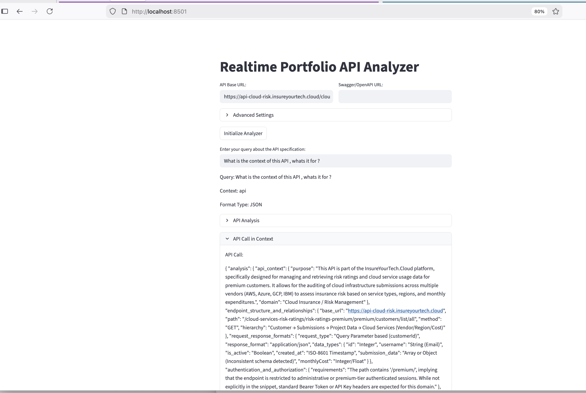

# Gemini RAG API Specification Analyzer

This application provides a RAG-based API specification and analysis system for Swagger/OpenAPI files using GCP Gemini and FAISS.



## Prerequisites

- Docker installed on your system
- Make installed on your system
- GCP API key configured (for Gemini access)
- Swagger/OpenAPI specification URL

## Quick Start

### Using Make

The project includes a Makefile for common operations:

1. Show available commands:
```bash
make help
```

2. Build the Docker image:
```bash
make build
```

3. Run the containers (requires GCP API key) , either or both :
```bash
export GEMINI_API_KEY=your_api_key
export GEMINI_INFERENCE_MODEL=gemini-3-flash-preview
make run_all
OR 
make run_api ; make run_streamlit
```

4. Clean up Docker resources:
```bash
make clean
```

### Manual Docker Commands

If you prefer not to use Make:

1. Build the Docker image:
```bash
docker build -t gemini-rag-api .
```

2. Run the streamlit APP container:
```bash
make run_streamlit
```

## Development

### Using Make

1. Set up development environment:
```bash
make dev
```

2. Run tests:
```bash
make test
```

3. Run linting:
```bash
make lint
```

### Manual Development Setup

For local development without Docker:

1. Create a virtual environment:
```bash
python -m venv venv
source venv/bin/activate  # On Windows: venv\Scripts\activate
```

2. Install dependencies:
```bash
pip install -r requirements.txt
pip install -r requirements-dev.txt
```

3. Run the application:
```bash
streamlit run datamap/realtime_portfolio_schema_analyzer.py
```

## Environment Variables

The following environment variables can be set when running the container:

- `GEMINI_API_KEY`: Your Gemini API key
- `GEMINI_INFERENCE_MODEL`: Gemini model to use (default: gemini-3-flash-preview)
- `GEMINI_EMBEDDING_MODEL`: Gemini embedding model (default: models/gemini-embedding-001)
- `GCP_REGION`: GCP region (default: us-central1)

1. Quick Run Free-Tier GCP
```bash
export GEMINI_API_KEY="<<GEMINI_API_KEY>>"  ; make build ; make run_all 
```

## Project Structure

- `gemini_datamap_rag.py`: Core RAG implementation
- `realtime_portfolio_schema_analyzer.py`: Streamlit interface
- `realtime_portfolio_api.py`: FastAPI interface
- `api_swagger_data_source.py`: API/Swagger data source handler
- `requirements.txt`: Production Python dependencies
- `requirements-dev.txt`: Development Python dependencies
- `requirements-api.txt`: API-specific dependencies
- `Dockerfile`: Container configuration
- `Makefile`: Build and development commands
- `config/`: Directory for configuration files

## Testing and Quality Assurance

The project includes:
- Unit tests (run with `make test`)
- Linting (run with `make lint`)
- Type checking with mypy
- Code formatting with black and isort

## License

This project is licensed under the MIT License - see the LICENSE file for details.

