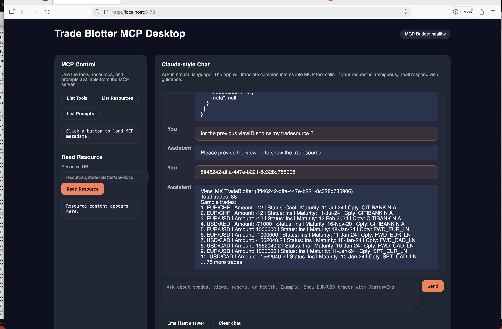
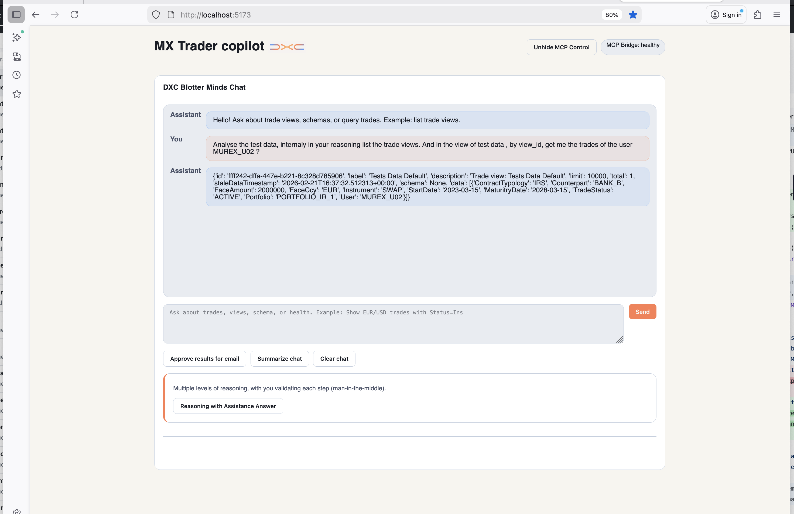
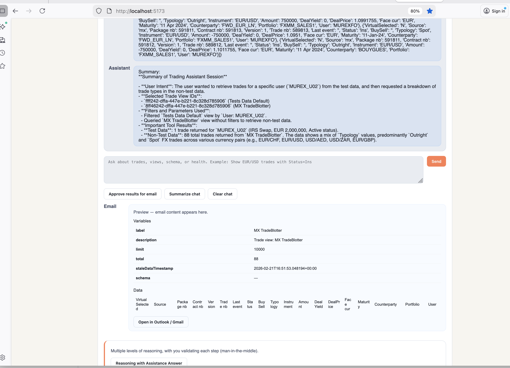

# Trade Blotter MCP Stack

# Trade Blotter using MCP








This repo runs three containers on a shared Docker network (`mcp-hackathon`):

- `trade-api`: FastAPI mock Trade Blotter API (`/health`, `/v1/api/trade-blotter/...`)
- `mcp-server`: MCP HTTP bridge exposing tools/resources/prompts
- `desktop-app`: Node.js desktop-style web UI for executing MCP queries

## Architecture

```
desktop-app (Node/Express)
    -> MCP HTTP bridge (/tools, /tool/{name}, /resources, /prompts)
        -> MCP server logic (tools call FastAPI)
            -> trade-api (FastAPI + CSV-backed data)
```

## Requirements

- Docker and Docker Compose

## Start the stack

From the repo root:

```
export GEMINI_API_KEY=your_api_key
export GOOGLE_API_KEY=your_api_key
export GEMINI_INFERENCE_MODEL=gemini-2.5-pro
export GEMINI_CONTEXT_MODEL=gemini-2.5-pro
export GEMINI_EMBEDDING_MODEL=models/gemini-embedding-001
export GEMINI_TEMPERATURE=1.0
docker compose up --build
```

Services will be available at:

- Desktop UI: `http://localhost:5173`
- MCP HTTP bridge: `http://localhost:7001`
- Trade API: `http://localhost:8000`

## Operations

### trade-api

- Health: `GET /health`
- Views: `GET /v1/api/trade-blotter/trade-views`
- View details: `GET /v1/api/trade-blotter/trade-views/{viewId}`

### mcp-server (HTTP bridge)

- Health: `GET /health`
- Tools: `GET /tools`
- Call tool: `POST /tool/{name}` with body `{ "arguments": { ... } }`
- Resources: `GET /resources`
- Read resource: `GET /resource?uri=resource://trade-blotter/api-docs`
- Prompts: `GET /prompts`
- Get prompt: `POST /prompt/{name}` with body `{ "arguments": { ... } }`

### desktop-app

Open `http://localhost:5173` and use:

- **Discovery** buttons to list tools/resources/prompts
- **Read Resource** for MCP resources
- **Call Tool** to execute MCP tool queries
- **Get Prompt** to fetch MCP prompt templates

## LLM (Gemini) usage for the MVP

The MVP is LLM-ready through MCP: the model reads the available tools and
decides which tool calls to make against the MCP HTTP bridge. Gemini is the
recommended LLM for this stack.

### Configure Gemini

Set your API key (and optionally a model):

```
export GEMINI_API_KEY=your_api_key
export GEMINI_INFERENCE_MODEL=gemini-3.1-pro-preview
export GEMINI_CONTEXT_MODEL=gemini-3.1-pro-preview
export GEMINI_TEMPERATURE=1.0
```

### How the LLM uses the MVP

1. The LLM lists tools from the MCP bridge:
   - `GET http://localhost:7001/tools`
2. It selects a tool based on the user request (e.g., "show trades for EUR/USD").
3. It calls the tool:
   - `POST http://localhost:7001/tool/{name}` with body `{ "arguments": { ... } }`

This keeps the LLM logic separate from the API/desktop UI while still enabling
natural-language trade queries through MCP.

## Stop the stack

```
docker compose down
```

